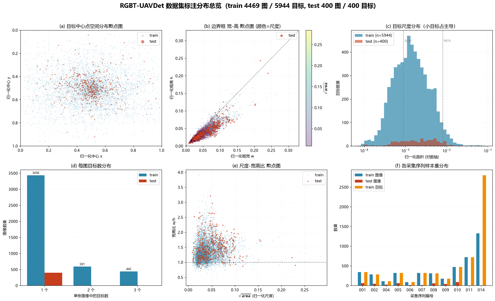
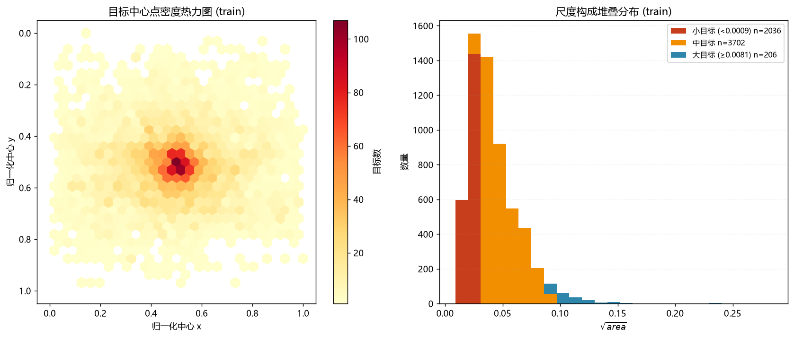
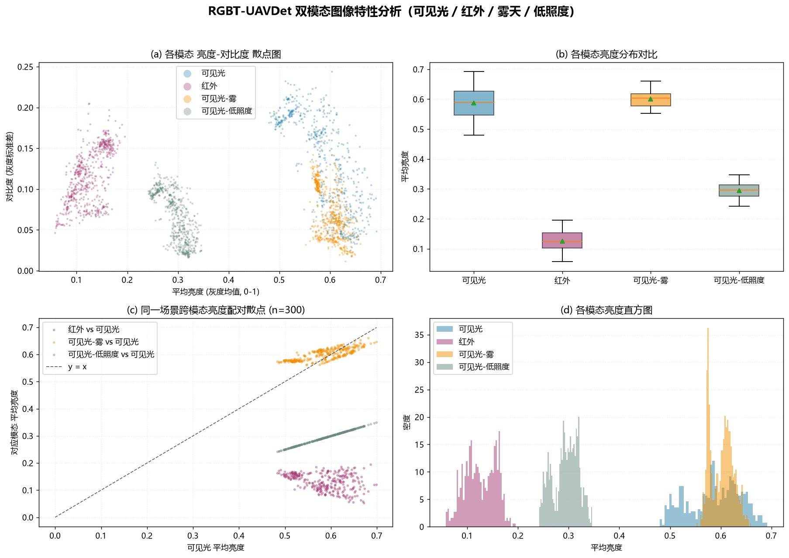

# RGBT-UAVDet: 面向反无人机检测的可见光–红外双模态数据集

**RGBT-UAVDet** 是一个用于**反无人机（Anti-UAV）目标检测**的可见光–红外双模态数据集。数据集以空间严格配准的图像对形式组织，同时提供雾天、低照度两种可见光退化版本，用于评估检测模型在复杂成像条件与模态协同下的鲁棒性。

> 📦 **数据发布说明**：为保证评审与发表的公平性，本仓库当前仅公开数据集的统计描述与分布分析。**论文录用后，我们将在此发布完整数据集。**
> The full dataset will be released here upon paper acceptance.

---

## 📊 数据集概览

| 项目 | 说明 |
|---|---|
| 任务类型 | 反无人机目标检测（双模态） |
| 模态 | 可见光（RGB）＋ 红外（IR），逐像素空间配准 |
| 图像对数量 | **4,869 对**（训练 4,469 ／ 测试 400） |
| 图像版本 | 每对含 4 个版本：`vis` 可见光、`inf` 红外、`vis_fog` 雾天退化、`vis_ll` 低照度退化，共 **19,476 张** |
| 图像规格 | 640 × 640，RGB 存储 |
| 类别 | **1 类：UAV（无人机）** |
| 标注总数 | **6,344** 个边界框（训练 5,944 ／ 测试 400） |
| 标注格式 | YOLO（`class x_center y_center width height`，归一化坐标） |
| 数据来源 | 无人机采集视频序列抽帧，训练 11 个序列 ／ 测试 9 个序列 |
| 划分方式 | 逐序列按时间划分，训练/测试共享序列但帧不重叠 |

## 🗂 目录结构

```
uav_data_ori/
├── vis/          # 可见光原始图像
│   ├── train/    #   4,469 张
│   └── test/     #     400 张
├── inf/          # 红外图像（与 vis 同名配准）
├── vis_fog/      # 雾天退化可见光
├── vis_ll/       # 低照度退化可见光
└── labels/       # YOLO 格式标注（与 vis 同名对应）
    ├── train/    #   4,469 个 .txt
    └── test/     #     400 个 .txt
```

四个模态目录与标注目录**文件名完全一致**，任意一对可见光–红外图像共享同一目标框标注。

## 📈 数据分布分析

### 标注分布总览



### 目标空间与尺度分布



### 双模态图像特性



## 🔍 关键统计

### 边界框统计（归一化坐标）

| 统计项 | 训练集 | 测试集 |
|---|---|---|
| 目标数 | 5,944 | 400 |
| 宽度中位数 | 0.0425 | 0.0591 |
| 高度中位数 | 0.0315 | 0.0380 |
| 宽高比中位数 | 1.32 | 1.45 |
| 面积中位数 | 0.00135 | 0.00229 |

### 目标尺度构成（按归一化面积）

| 尺度 | 阈值 | 训练集占比 | 测试集占比 |
|---|---|---|---|
| 小目标 | < 0.0009 | 34.3%（2,036） | 23.8%（95） |
| 中目标 | 0.0009 – 0.0081 | 62.3%（3,702） | 67.8%（271） |
| 大目标 | ≥ 0.0081 | 3.5%（206） | 8.5%（34） |

数据集以**小目标为主**：多数目标在 640×640 图像中仅占数十像素，符合远距离反无人机场景的实际成像特点。

### 每图目标数

| 目标数/图 | 训练集 | 测试集 |
|---|---|---|
| 1 | 3,436（76.9%） | 400（100%） |
| 2 | 591（13.2%） | 0 |
| 3 | 442（9.9%） | 0 |

### 模态成像特性（随机采样 600 张/模态）

| 模态 | 平均亮度 | 亮度标准差 | 对比度（灰度标准差） |
|---|---|---|---|
| 可见光 `vis` | 0.587 ± 0.051 | 0.051 | **0.132** |
| 红外 `inf` | 0.126 ± 0.030 | 0.030 | 0.117 |
| 雾天 `vis_fog` | 0.601 ± 0.023 | 0.023 | 0.070 |
| 低照度 `vis_ll` | 0.294 ± 0.025 | 0.025 | 0.066 |

可见：
- **红外图像整体偏暗**（亮度约为可见光的 1/5），但保留了较高的局部对比度，目标热特征明显；
- **雾天版本亮度与可见光接近，但对比度下降约 47%**，呈典型的低对比度退化；
- **低照度版本亮度约为可见光的一半，对比度同样下降约 50%**；
- 同一场景跨模态亮度配对散点显示，雾天/低照度退化与原始可见光呈强线性相关，说明退化版本由同一源图像导出，标注框可直接共用。

### 各序列样本量

| 序列 | 001 | 002 | 004 | 005 | 006 | 007 | 008 | 009 | 010 | 011 | 014 |
|---|---|---|---|---|---|---|---|---|---|---|---|
| 训练图像 | 344 | 282 | 110 | 320 | 89 | 323 | 310 | 175 | 470 | 719 | 1,327 |
| 训练目标 | 344 | 282 | 110 | 320 | 89 | 323 | 310 | 175 | 470 | 719 | 2,802 |
| 测试图像 | 63 | 44 | 22 | 59 | 15 | 11 | 54 | 42 | 90 | — | — |

多目标帧集中在序列 014（1,327 帧含 2,802 个目标，平均约 2.1 个/帧），其余序列以单目标帧为主；序列 011、014 未划入测试集。

## 📋 标注格式

每张图像对应一个同名 `.txt` 文件，每行一个目标：

```
<class_id> <x_center> <y_center> <width> <height>
0 0.460740 0.133084 0.265209 0.144321
```

- `class_id`：类别索引，本数据集仅 `0`（UAV）
- 坐标均为相对图像宽高的归一化值（0–1）
- 训练集与测试集**均无空标注图像**，每张图至少含 1 个目标

## 📦 完整数据集获取

当前仓库仅提供数据集统计信息与分布分析图表。

**论文录用后，完整数据集（含全部 19,476 张图像与标注）将在此仓库发布。**

如需在录用前获取数据用于学术合作，请通过 GitHub Issue 联系。

## 📚 引用

如果您使用本数据集，请引用（录用后更新 BibTeX）：

```bibtex
@misc{RGBT-UAVDet,
  title  = {RGBT-UAVDet: A Dual-Modal Visible-Infrared Dataset for Anti-UAV Detection},
  author = {Zhou},
  year   = {2026},
  url    = {https://github.com/Surprise-Zhou/RGBT-UAVDet-dataset}
}
```

## 📄 License

数据集遵循论文录用后公开的许可协议发布（计划采用 CC BY-NC-SA 4.0）。

---

# RGBT-UAVDet: A Dual-Modal Visible–Infrared Dataset for Anti-UAV Detection (English)

**RGBT-UAVDet** is a dual-modal visible–infrared (RGB-T) dataset for **anti-UAV object detection**. It consists of spatially registered image pairs, together with two degraded visible variants (fog and low-light), to evaluate detection robustness under challenging imaging conditions and cross-modal collaboration.

> 📦 **Release note**: only the statistical description and distribution analysis are public for now. **The full dataset will be released here upon paper acceptance.**

## Overview

| Item | Value |
|---|---|
| Task | Anti-UAV object detection (dual-modal) |
| Modalities | Visible (RGB) + Infrared (IR), spatially registered |
| Image pairs | **4,869** (train 4,469 / test 400) |
| Versions per pair | `vis`, `inf`, `vis_fog`, `vis_ll` — **19,476 images** in total |
| Resolution | 640 × 640, RGB |
| Classes | **1 class: UAV** |
| Annotations | **6,344** boxes (train 5,944 / test 400) |
| Format | YOLO (`class x_center y_center width height`, normalized) |
| Source | Frames from UAV-captured video sequences (11 train / 9 test sequences) |

## Key statistics

- **Small-object dominant**: 34.3% of training objects have a normalized area below 0.0009; the median bounding box is 0.0425 × 0.0315 in normalized coordinates.
- **Every image contains at least one object** (no empty annotations); each test image contains exactly one object.
- **Infrared images are much darker** (mean brightness 0.126 vs. 0.587 for visible) but preserve comparable local contrast (0.117 vs. 0.132).
- **Fog and low-light variants are derived from the same source images**: their brightness correlates linearly with the original visible images, and contrast drops by ~47–50%, which makes the shared bounding-box annotations directly reusable across all four versions.

## Folder layout

```
uav_data_ori/
├── vis/        # visible images (train 4,469 / test 400)
├── inf/        # registered infrared images (same filenames as vis)
├── vis_fog/    # fog-degraded visible
├── vis_ll/     # low-light-degraded visible
└── labels/     # YOLO .txt annotations (same filenames as vis)
```

## Citation

Please cite (BibTeX to be updated upon acceptance) — see the Chinese section above.
